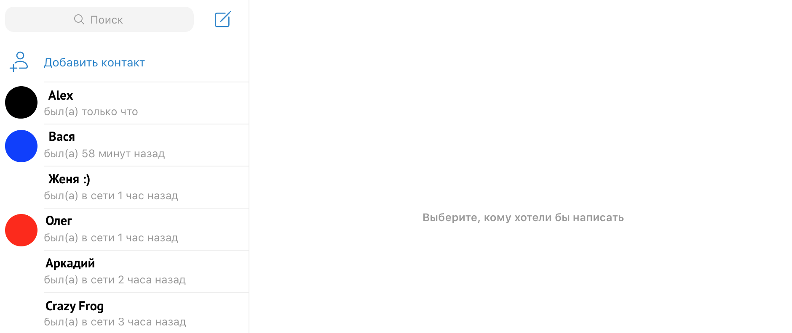

# Задача №1. Только что

Социальные сети и мессенджеры показывают, когда ваш собеседник последний раз был онлайн:

Используя when, напишите функцию agoToText (скорее всего, вам понадобится не одна функция), которая учитывает, сколько времени прошло с последнего визита пользователя, и выдаёт текст (String).

Нас будет интересовать вся фраза, например, был(а) только что или был(а) в сети 3 часа назад.

## Какие правила стоит учесть

1. Если количество секунд от 0 до 60, используйте вариант с только что.
2. Если количество секунд от 61 до 60 * 60 (один час), вариант с x минут назад.
3. Если количество секунд от 60 * 60 + 1 до 24 * 60 * 60 (сутки), вариант с x часов назад.
4. Если количество секунд от суток до двух, вариант вчера.
5. Если количество секунд от двух суток до трёх, вариант позавчера.
6. Если количество секунд больше трёх суток, вариант давно.
   
Вам понадобятся вспомогательные функции, которые умеют делать:

- 1 минуту назад,
- 2 минуты назад,
- 5 минут назад,
- 11 минут назад,
- 21 минуту назад,
- 25 минут назад.
  
То же самое с часами: час, часа, часов.